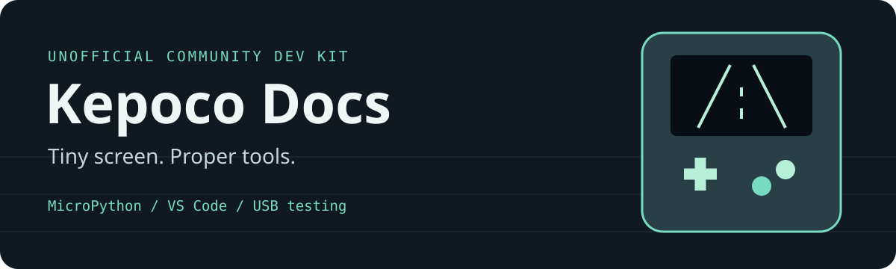

I need sum stars please twin if u see this

<p align="center"></p>

<p align="center">
  <a href="https://github.com/Harvey-King/KepocoDocs/actions/workflows/ci.yml"></a>
  <a href="https://github.com/Harvey-King/KepocoDocs/releases"></a>
  
  <a href="LICENSE"></a>
</p>

# Kepoco Docs & Dev Kit

Source-grounded documentation and practical tools for building MicroPython games on the University of Kent's Kepoco handheld. Write in VS Code, get real autocomplete, then run your saved game on the handheld over USB—without using the web editor.

I started this because I couldn't find the reference I needed for my university project. The docs and stuff were non existant and i realised that it was very very very annoying so i js done this because who the fuck wants to work without docs.

## Start here

| I want to… | Open |
|---|---|
| Set up my editor and write a first game | [Getting started](GETTING_STARTED.md) |
| Save, test and upload from VS Code | [USB workflow](USB_WORKFLOW.md) |
| Browse explained, runnable lessons | [Example cookbook](examples/README.md) |
| Learn drawing, controls, sprites, audio and saves | [Feature guide](FEATURE_GUIDE.md) |
| Find exact methods and parameters | [API reference](API_REFERENCE.md) |
| Understand firmware bugs and backend differences | [Firmware notes](FIRMWARE_NOTES.md) |
| Download the extension or complete kit | [Releases](https://github.com/Harvey-King/KepocoDocs/releases) |

## What's included

- **VS Code IntelliSense:** completion, parameter hints, hover documentation and definition navigation based on 17 supplied Python modules.
- **MicroPython hints:** `machine`, tick timing and other editor-only RP2 APIs.
- **USB tasks:** run a saved file temporarily, install a game, inspect firmware, open the REPL or return to the menu.
- **Verified uploads:** SHA-256 of the remote game must match the local saved file.
- **Eight snippets:** game loop, sprite, text, rectangle, tone, saves, buttons and fonts.
- **SWERVE:** a complete driver's-eye traffic-dodging game for the 72×40 screen.
- **Auditable source:** preserved snapshot, provenance hashes, source-linked docs and automated checks.

## Quick setup

You need VS Code with Microsoft's **Python** and **Pylance** extensions, Python 3.11+, a USB data cable and the handheld's existing Kepoco firmware.

1. Clone this repository or download the portable kit from [Releases](https://github.com/Harvey-King/KepocoDocs/releases).
2. Open the whole folder in VS Code, or open `Kepoco.code-workspace`.
3. Create the local Python environment:

   ```sh
   python -m venv .venv
   ```

   On Windows:

   ```powershell
   .\.venv\Scripts\python.exe -m pip install -r requirements-dev.txt
   ```

   On macOS/Linux:

   ```sh
   .venv/bin/python -m pip install -r requirements-dev.txt
   ```

4. Download `kepoco-devkit-0.2.0.vsix` from [Releases](https://github.com/Harvey-King/KepocoDocs/releases). In VS Code, use **Extensions: Install from VSIX**, then reload the window. The portable archive also includes it. The extension is not published to the Marketplace.
5. Connect the handheld and **disconnect it from the web editor**.
6. Open `swerve.py`, press **Ctrl+S**, then **Ctrl+Shift+B**.

The USB task runs the saved file on the handheld. Its output and tracebacks appear in the VS Code terminal. The regular desktop Python ▶ button is not the USB runner.

For IntelliSense in another project, use **Kepoco: Set Up Current Project**. That command installs editor hints, not the repository's USB tasks; use this checkout as your USB-enabled starter workspace.

## Keep a game on the handheld

Choose **Terminal → Run Task → Kepoco: Upload current game to handheld**.

A single saved `swerve.py` is installed at `/Games/swerve/swerve.py` and verified against its local SHA-256. Re-uploading replaces only that game file. The task does not touch startup files, firmware libraries or your downloaded dump.

Then choose **Kepoco: Return to device menu**. Menu listing behavior can depend on installed firmware; the upload and remote contents were verified, but automatic menu registration has not been visually checked.

## Explained examples

Start with the [menu + settings + slider lesson](examples/02_menu_settings_slider.py), then work through movement, sprite animation, collision/scoring and a stopwatch. Every lesson is a standalone `.py` file with comments and controls.

| Example | Learn |
|---|---|
| [Menu, settings and slider](examples/02_menu_settings_slider.py) | Change a speed variable and use it in gameplay |
| [Smooth movement](examples/03_smooth_movement.py) | Held input, elapsed time and screen bounds |
| [Animated sprite](examples/04_animated_sprite.py) | Bitmap frames and timed animation |
| [Collect the dot](examples/05_collect_the_dot.py) | Collision, score and respawning |
| [Stopwatch](examples/06_stopwatch.py) | Start/pause/reset and wrap-safe timing |

The [example cookbook](examples/README.md) explains how each works and what to change. Save a lesson and press **Ctrl+Shift+B** to run it through this workspace's USB task. Settings in the slider lesson are in memory, not permanently saved to the handheld. Host tests do not replace physical play testing.

## SWERVE

<p align="center"></p>

This preview is generated from the actual game's drawing functions on the PC—not a device screenshot.

| Button | Action |
|---|---|
| A | Start / retry |
| Left / right | Steer |
| Hold A | Boost |
| B | Exit |

[Game source](swerve.py) · [Minimal steering example](examples/01_quickstart.py)

## What has actually been checked?

| Check | Evidence / boundary |
|---|---|
| Real VS Code language providers | Completion, hover, signatures and definitions passed; rerun **Kepoco: Check IntelliSense** locally |
| Host tests and static analysis | Automated game, generator, extension, USB safety and packaging checks; CI also verifies positive/negative type diagnostics |
| Real USB upload | SWERVE remote SHA-256 matched the saved local file |
| Real handheld execution | Existing KEPOCO MicroPython 1.29.0 runtime; display reported 72×40; 60 gameplay frames plus title/crash screens executed without an exception |
| Human play testing | Physical controls, visible rendering quality and long sessions still need testing |
| Archived library | Audited statically, not installed as replacement firmware; known defects are documented |

**Editor hints do not provide a desktop emulator or repair firmware.** The archived sources contain real defects, including `getPixel` returning no value, misspelled API names and broken fallback/VGA code. Read [Firmware notes](FIRMWARE_NOTES.md) before relying on specialist features.

## Repository map

```text
GETTING_STARTED.md       Setup and first steps
FEATURE_GUIDE.md         Feature-oriented reference
API_REFERENCE.md         Exact source declarations
FIRMWARE_NOTES.md        Compatibility audit
USB_WORKFLOW.md          VS Code → USB → handheld
swerve.py                Complete example game
examples/                Small target-runtime examples
typings/                 Editor-only Kepoco and time hints
vendor/micropython/       Supplemental hints and original notices
source-library/          Unmodified reference snapshot, not an upload bundle
vscode-extension/        Extension source and snippets
tools/                   USB runner, static generator and release checks
tests/                   Host tests; no device required
evidence/                Source and vendor provenance
```

## Contributing and building

See [CONTRIBUTING.md](CONTRIBUTING.md) for local checks and reproducible release builds, and [CHANGELOG.md](CHANGELOG.md) for changes.

Found a mismatch? [Open an issue](https://github.com/Harvey-King/KepocoDocs/issues) with the exact traceback, source filename/line, firmware identification and whether you used a physical handheld or emulator. Never include credentials or personal device IDs.

## Licence and attribution

Newly authored code and docs are GPL-3.0-or-later. Original source and vendored dependencies retain their own notices and terms; some supplied drivers do not carry an explicit header, and this project does not invent a licence for them. See [LICENSE](LICENSE) and [THIRD_PARTY_NOTICES.md](THIRD_PARTY_NOTICES.md).
